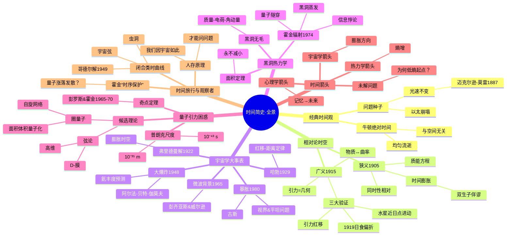

---
{"dg-publish":true,"permalink":"/deepin-md/mindful/2026-01-06/","dgPassFrontmatter":true}
---

```mermaid

mindmap
  root((时间简史·全景))
    经典时间观
      牛顿绝对时间
        均匀流逝
        与空间无关
      问题种子
        光速不变
          迈克尔逊-莫雷1887
        以太崩塌
    相对论时空
      狭义1905
        同时性相对
        时间膨胀
          双生子佯谬
        质能方程
      广义1915
        物质↔曲率
        引力=几何
        三大验证
          水星近日点进动
          1919日食偏折
          引力红移
    宇宙学大事表
      弗里德曼解1922
        膨胀时空
      哈勃1929
        红移-距离定律
      大爆炸1948
        阿尔法-贝特-伽莫夫
        氦丰度预测
      微波背景1965
        彭齐亚斯&威尔逊
      暴胀1980
        古斯
        视界&平坦问题
    黑洞热力学
      黑洞无毛
        质量-电荷-角动量
      面积定理
        永不减小
      霍金辐射1974
        量子隧穿
        黑洞蒸发
        信息悖论
    量子引力困惑
      奇点定理
        彭罗斯&霍金1965-70
      普朗克尺度
        10⁻³⁵ m
        10⁻⁴³ s
      候选理论
        弦论
          高维
          D-膜
        圈量子
          自旋网络
          面积体积量子化
    时间箭头
      热力学箭头
        熵增
      心理学箭头
        记忆→未来
      宇宙学箭头
        膨胀方向
      未解问题
        为何低熵起点？
    时间旅行与观察者
      闭合类时曲线
        哥德尔解1949
        宇宙弦
        虫洞
      霍金“时序保护”
        量子涨落发散？
      人存原理
        我们因宇宙如此
        才能问问题
```