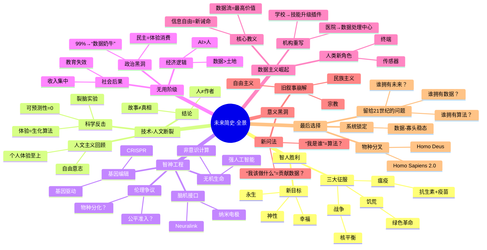

---
{"dg-publish":true,"permalink":"/deepin-md/mindful/2026-01-06/","dgPassFrontmatter":true}
---

# “体验自我”和“叙事自我”是心理学和认知科学里用来区分“当下正在感受的我”与“事后讲故事的我”的一对概念。它们对应的大脑系统、时间感、记忆方式、情绪权重都不一样，简单说：

维度	体验自我（Experiencing Self）	叙事自我（Narrating Self）	
时间焦点	此刻（now）	过去与未来（then & next）	
主要任务	实时感知、评估苦乐	把离散体验串成连贯故事	
记忆痕迹	粗糙、易逝	经语言加工后固化	
情绪权重	峰值-终值法则（peak-end rule）	故事高潮+意义框架	
脑区侧重	边缘系统、岛叶、基底节	默认模式网络、内侧前额叶、海马	
典型提问	“此刻我疼不疼？”	“我这一生幸福吗？”	
决策陷阱	即时满足、损失厌恶	事后合理化、沉没成本	

一句话例子

体验自我：手术台上“现在这一秒真疼”。

叙事自我：出院后“那场手术其实也没那么可怕”。

两个自我常常打架：  
- 度假时体验自我在烈日下排队，叙事自我事后却说“那次冰岛之旅超难忘”。  
- 熬夜打游戏爽的是体验自我，第二天叙事自我懊悔“我怎么又毁了自己的计划”。

理解这对概念的最大用处，是提醒我们：  
1. 别把“事后总结”当成“当时真相”；  
2. 想提升长期幸福感，要同时照顾体验（减少当下痛苦）和叙事（让故事说得通）；  
3. 做重大选择时，先让体验自我收集现场数据，再让叙事自我写“草稿”，最后把草稿冷却几天，防止被单一自我绑架。

# 研究历史为了从旧的意义中解放出来历史知识改变我们未来的行为，预测未来，并不只是预言，预测经过讨论能改变未来。

